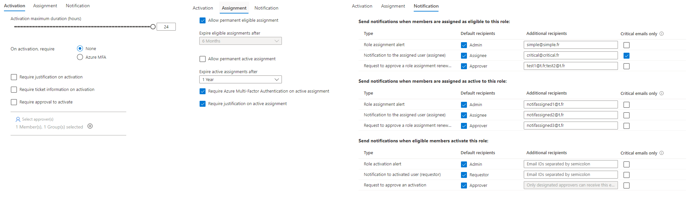

# Pim Bulk Actions

The main goal of this repo is  to help you leverage Azure AD Privileged Access *(currently in preview as of 10/Nov/2022)* using an API. GraphAPI does not let you change these values *yet*.

``` All the information are from my personal research and reversing the structure. It may be wrong. I am sharing my findings, but don't use it thinking it is an official documentation that will last overtime ```

## TLDR : how to run the file
- `cd site`
- `ts-node index.ts`

## Files present in the repo

- 'site': This is the typescript project that will let you call the API, both the Graph API and the PIM endpoints
- 'addOn' : This is a chrome addon to automatically fetch the  *token you will need to use to call the PIM endpoints*. 
  
`The authorization bearer differs from the one you use in GraphAPI. I did not dig enough to understand how a JWT works, nor how to translate to a PIM token from the one you have for the GraphAPI`


## Chrome Extension

The chrome extension is very basic : It will inject a Javascript script into your page `addOn/scripts/hacky_copy.js` that will listen to an event.
The event is pushed by a service worker : `addOn/scripts/background.js`. This was my first time creating a Chrome Extension so thanks to the doc *(and stack-overflow... a lot)* I managed to have something working.
It is using `document.execCommand('copy')` which is deprecated so it is bound to stop working at any time.
If you want to grab the token manually, go into <https://portal.azure.com/#view/Microsoft_AAD_IAM/GroupDetailsMenuBlade/~/EnablePrivilegedAccess/groupId/YOUR_AAAD_GROUP_ID>, press f12, go into network, and find the token there.

This extension will automatically add into your clipboard the token needed by PIM when you navigate in your AAD in Groups -> <Your Desired Group> -> Privileged Access (Preview)

## Site

The app is basically a way to leverage GraphAPI using typescript. I am much more comfortable using Typescript than PowerShell, thus it was my solution of choice.
It's heavily based on Microsoft documentation.

### What do you need to create

You will need to create a couple files into your site folder
- 'raw_token.ini' :  This is where you will paste your authorization token you got from the Chrome Extension described above
- '.env' : Where you will store your application ID, ClientID, TenantID. More infos about `.env` files [here](https://docs.github.com/en/actions/learn-github-actions/environment-variables#about-environment-variables). You will also find an entry **GROUP_ID** so you can test a specific AAD Group without querying it with the graphAPI

### How does it work

#### AAD Group ID to PIM Group ID

The first thing you need to do is to convert your Group ObjectID to an ID that is know by the PIM endpoint.Every request will query <https://api.azrbac.mspim.azure.com/api/v2/privilegedAccess/aadGroups/roleSettingsV2>
So by calling this URL + ``?$expand=resource,roleDefinition($expand=resource)&$filter=(resource/id+eq+%27${aadId}%27)&$orderby=lastUpdatedDateTime+desc`` where `${aadid}` is our AAD Group ID, it will return us the correct value.

From this request, we will receive our PimGroupID and the configuration associated to this group.

#### How is the PIM Configuration structure built

The PIM structure you receive is made of 

- `id` : This is the PimGroupID, then identifier pushed to PIM that will then translate to the AAD Group ID
  
-  `lifeCycleManagement` : 2 arrays. This is what we will need to update when we will patch our configuration
There is one for each type, either **OWNER** or **MEMBER**.


- `roleDefinition` : structure of the role definition similar to the one you have on  the Graph API

- `resource` : Group Identifier

Beside the `id`, than we can get by calling `getUrlAadIdToPimId` in `site/PIM/undocumented.ts` , the `roleDefinition` and the `resource` is given to us, so we do not have to change it. Only the lifeCycleManagement will have to be updated.

## Understanding the LifeCycleManagement structure

As said previously,  you will find in your body 2 lifecyclemanagement structures as a JSON, that I will treat as objects.
One for the owner, the other one for the member


By changing the LifeCycleManagement, we will be able to apply changes to these 3 panels


You can access this panel here with the correct Group ID : <https://portal.azure.com/#view/Microsoft_Azure_PIMCommon/RoleSettingsEdit/policyId/AAD_GROUP_ID_TO_CHANGE/roleName/Member>
Or by going, from the Azure AD panel -> Groups -> Your desired group -> Privileged Access (Preview) -> Settings


```typescript
export interface LifeCycleManagement {
    caller: CallerType;
    level: LevelType;
    operation: string;
    value: Value[];
}
```

Let's have a look at this first 2 members of this interface
- `caller` : You have two values possible : `Admin` and `EndUser`. *We will get back to these values below*
- `level` : You have two values possible : `Eligible` and `Member`. *We will get back to these values below*
- `operation` : I did not dig too much, but overall the value looks to be `ALL`. I did not play with this value.
- `value` : an array of values, that will actually be our PIM rules. **More information below**


So basically, we have `caller` and `level` that, once paired together will be able to provide us some information : 

### [`"caller": "Admin", "level":"Member"`] : Changes to the tab `ASSIGNMENT`


### [`"caller": "EndUser", "level":"Member"`] : Changes to the tab `ACTIVATION`


### [`"caller": "Admin", "level":"Eligible"`] : Changes to the tab `NOTIFICATION` for Eligibility part


<span style="color: red"> You may find some other couple or **CALLER** and **LEVEL**, I only tried to have an impact on what is available on the GUI, there may be some interresting shenanigans behind the scene. Some options are also a little bit mixed but I will try to explain them as much as possible. </span>

# Understanding PIM rules

To sump up, let's get back to our LifeCycleManagement structure : 

```typescript
export interface LifeCycleManagement {
    caller: CallerType;
    level: LevelType;
    operation: string;
    value: Value[];
}
```
Eventually we will have something like 

```json
{
    "caller":"Admin",
    "operation":"ALL",
    "level":"Member",
    "value":[
        {
        "ruleIdentifier":"ExpirationRule",
        "setting":"{\"permanentAssignment\":false,\"maximumGrantPeriodInMinutes\":525600}"
        },
        {
        "ruleIdentifier":"MfaRule",
        "setting":"{\"mfaRequired\":true}"
        },
        {
        "ruleIdentifier":"JustificationRule",
        "setting":"{\"required\":true}"
        },
        {
        "ruleIdentifier":"NotificationRule",
        "setting":"{\"policies\":[{\"deliveryMechanism\":\"email\",\"setting\":[{\"customreceivers\":[\"notifassigned1@t.fr\"],\"isdefaultreceiverenabled\":true,\"notificationlevel\":2,\"recipienttype\":2},{\"customreceivers\":[\"notifassigned2@t.fr\"],\"isdefaultreceiverenabled\":true,\"notificationlevel\":2,\"recipienttype\":0},{\"customreceivers\":[\"notifassigned3@t.fr\"],\"isdefaultreceiverenabled\":true,\"notificationlevel\":2,\"recipienttype\":1}]}]}"
        }
    ]
},
```


We still did not look at the Value array, which is our most important topic : This is where we will setup the rules. we want to change and update.

```typescript
export interface Value {
    ruleIdentifier: string;
    setting: string; // this is a PimRule that is stringified;
}
```

- `ruleIdentifier` : This is a string that will document what our rule does.
- `setting` : This is a json, stringified, which is the configuration of our rule.


## Different rules

I found out about these different rules, and we shall try to explain them all.

```typescript
export type PimRule = ExpirationRule | NotificationRule | MfaRule | JustificationRule | TicketingRule | ApprovalRule;
``` 


## Expiration Rule

Rule is found in the pairs 
- `[Admin, Eligible]`, which is the **assignment** tab under *Allow permanent eligible assignement*
- `[Admin, Member]` , which is the **assignment** tab under *Allow permanent active assignment*
- `[EndUser, Member]` , which is the **activation** tab under *Activation maximum duration (hours)*

```typescript
export interface ExpirationRule {
    permanentAssignment: boolean;
    maximumGrantPeriodInMinutes: number;
}
```

`permanentAssignent` is a boolean which is self explanatory. It is the time in minute (obviously).
You will not find a checkbox on the GUI for the pair `[EndUser, Member]` 

`maximumGrantPeriodInMinutes`, but differs according to the pair *( I did not test bypassing with values above what is possible on the GUI)*

- `[Admin, Eligible]`, from 15 days to 6 months
- `[Admin, Member]` , from 15 days to 1 year
- `[EndUser, Member]` , from 0 to 24 hours

## Notification Rule

Related to the panel notification.

```typescript
export interface NotificationRule {
    policies : NotifificationPolicy[];

}
export interface NotifificationPolicy {
    deliveryMechanism: string;
    setting: NotificationSetting[];
}

export interface NotificationSetting {
    customReceivers: null | string[];
    isDefaultReceiverEnabled: boolean;  
    notificationLevel: NOTIFICATION_LEVEL;
    recipientType: RECIPIENT_TYPE; 
}   

export enum RECIPIENT_TYPE {
    NOTIFICATION_TO_THE_ASSIGNED_USER = 0,
    REQUEST_TO_APPROVE_A_ROLE_ASSIGNMENT_RENEWAL_OR_EXTENSION = 1,
    ROLE_ASSIGNMENT_ALERT = 2,
}

export enum NOTIFICATION_LEVEL {
    CRITICAL = 1,
    NORMAL = 2
}

```

A notification rule has multiple policies
- `deliveryMechanism` : so far, I only saw "email"
- `setting` : A stringified rule of our notification and how it works. Let's dig into these settings

`NotificationSetting` has several notifications : 
- `recipientType` : You have on the notification tab 3 types of notifications per action ( actions being : **assigned as eligible**, **assigned as active**, **on activation**)
  - if the value is 0 : `NOTIFICATION_TO_THE_ASSIGNED_USER`
  - if the value is 1 : `REQUEST_TO_APPROVE_A_ROLE_ASSIGNMENT_RENEWAL_OR_EXTENSION`
  - if the value is 2 : `ROLE_ASSIGNMENT_ALERT`
  - 
- `notificationLevel` : 
  - 1 is Critical emails only checkbox ticked
  - 2 is Critical emails only checkbox unticked
  - 
- `customReceivers` : Array of emails you want people to be notified for this `recipientType`
 ```json
 {\"customreceivers\":[\"test1@t.fr\",\"test2@t.fr\"]
 ```

## Simple Rules

Simple rule with just a boolean to switch on/off

### MFA Rules

```typescript
export interface MfaRule {
    mfaRequired: boolean;
}
```


### Justification Rule

```typescript
export interface JustificationRule {
    required: boolean;
}
```


### Ticketing Rule

```typescript
export interface TicketingRule {
    ticketingRequired: boolean;
}
```


## Aproval rule

This role is to define the group or user that will approve once a member wants to have the role enabled.


```typescript
export interface Approvers {
    id: string;
    type : 'group' | 'user';
    displayName: string;
}
export interface ApprovalRule {
    enabled: boolean;
    approvers: Approvers[];
}
```

- `enabled` : Determine whether or not someone has to approve the membership
- `approvers` : List of AAD Groups, or AAD Users

The approvers interface is 
- `id` of the object (if it's a group, the Group Object ID, if it's a user, then  the User Object ID)
- `type` : either `group` or `user`
- displayName : The AADUserDisplayName, or the AADGroupDisplayName

As an example for a user you can find it here : 


